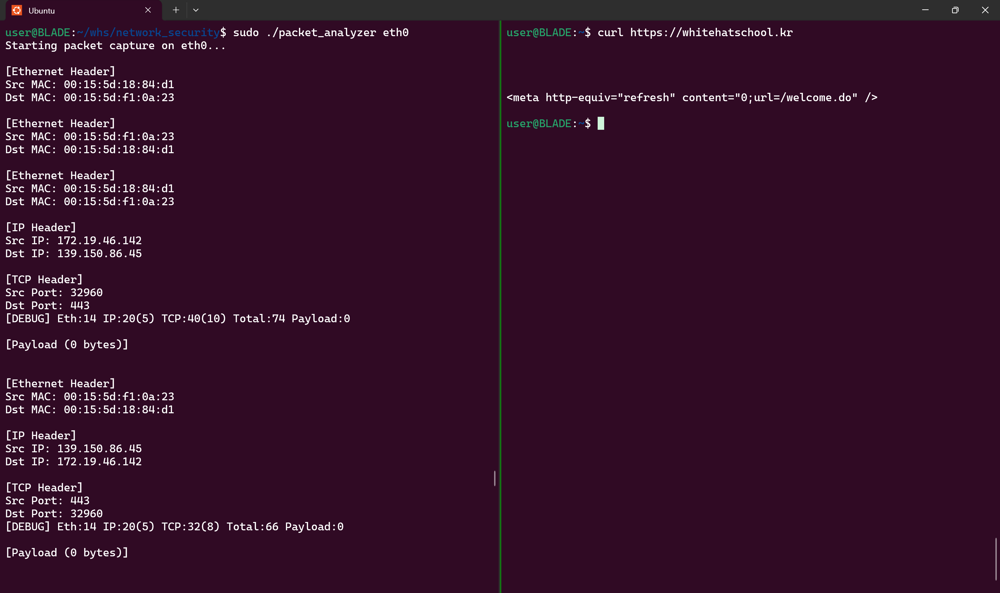

WHS3기 네트워크 보안 수업의 과제물입니다.

# PCAP Programming

## 1. 서론

본 과제는 C/C++ 기반의 PCAP API(libpcap)를 활용하여 네트워크 상의 패킷을 캡처하고, 그 중 TCP 프로토콜에 해당하는 패킷의 정보를 분석하여 출력하는 프로그램을 작성하는 것을 목표로 합니다.

프로그램은 아래와 같은 정보를 추출하여 출력합니다.

- **Ethernet 헤더:** 출발지 MAC 주소, 목적지 MAC 주소
- **IP 헤더:** 출발지 IP 주소, 목적지 IP 주소
- **TCP 헤더:** 출발지 포트, 목적지 포트
- **메시지:** TCP 페이로드(적당한 길이로 출력)

또한, IP 헤더와 TCP 헤더에 포함된 길이 정보를 올바르게 활용하여 정확한 데이터 오프셋을 계산하도록 구현하였습니다.

## 2. 개발 환경

- **운영체제:** Linux (혹은 Windows, MacOS 등)
- **컴파일러:** gcc/g++ (C/C++ 컴파일러)
- **라이브러리:** libpcap
- **IDE:** Code::Blocks, VSCode 등 (선택사항)
- **버전 관리:** Git (Github에 코드 제출)

## 3. 구현 방법

### 3.1. PCAP API 초기화 및 패킷 캡처

- **pcap_open_live()** 함수로 네트워크 인터페이스를 열어 패킷 캡처를 시작합니다.
- 캡처할 패킷의 최대 크기, promiscuous 모드, 타임아웃 등을 설정하여 라이브 캡처 환경을 구성합니다.
- **pcap_loop()** 또는 **pcap_dispatch()** 함수를 사용하여 캡처된 패킷에 대해 콜백 함수를 호출합니다.

### 3.2. 패킷 필터링 (TCP 프로토콜만 선택)

- 캡처된 패킷 중 TCP 프로토콜에 해당하는 패킷만 분석하도록 필터를 설정합니다.
- 코드 내부에서 Ethernet 헤더의 타입 값(IP 프로토콜) 및 IP 헤더의 프로토콜 필드(6: TCP)를 확인하여 TCP 패킷만 처리합니다.
- UDP 등 다른 프로토콜의 패킷은 무시하도록 구현하였습니다.

### 3.3. 패킷 구조 분석

네트워크 패킷은 여러 프로토콜 헤더가 중첩되어 있는 구조를 갖습니다. 본 프로그램에서는 다음과 같이 각 헤더의 정보를 추출합니다.

### 3.3.1. Ethernet 헤더 분석

- **구조체 정의:**
    
    Ethernet 헤더는 14바이트로 구성되며, 목적지 MAC, 출발지 MAC, 그리고 상위 프로토콜 타입(보통 IPv4: 0x0800)을 포함합니다.
    
- **추출 내용:**
    - 목적지 MAC 주소 (dst_mac)
    - 출발지 MAC 주소 (src_mac)

예시 코드:

```c
struct ethernet_header {
u_char dst_mac[6];
u_char src_mac[6];
u_short ether_type;
};
```

### 3.3.2. IP 헤더 분석

- **구조체 정의:**
    
    IP 헤더는 가변 길이 구조(기본 20바이트 이상)로, 헤더 길이(IHL) 필드를 활용하여 실제 헤더 크기를 계산합니다.
    
- **추출 내용:**
    - 출발지 IP 주소
    - 목적지 IP 주소
- **중요 사항:**
    
    IP 헤더의 IHL 값을 사용하여 IP 헤더의 실제 길이를 확인한 후, 그 다음 위치에서 TCP 헤더가 시작됨을 고려합니다.
    

```c
struct ip_header {
    u_char  ver_ihl;        // 버전 및 헤더 길이
    u_char  tos;
    u_short tlen;
    u_short identification;
    u_short flags_fo;
    u_char  ttl;
    u_char  proto;
    u_short crc;
    u_char  src_ip[4];
    u_char  dst_ip[4];
    // ...
};
```

### 3.3.3. TCP 헤더 분석

- **구조체 정의:**
    
    TCP 헤더 역시 가변 길이(최소 20바이트 이상)로 구성되며, 데이터 오프셋 필드를 통해 실제 TCP 헤더 길이를 파악할 수 있습니다.
    
- **추출 내용:**
    - 출발지 포트
    - 목적지 포트
- **메시지(페이로드) 추출:**
    
    IP와 TCP 헤더의 길이 정보를 활용하여, 패킷 내에서 실제 데이터(메시지)의 시작 위치와 길이를 계산하여 출력합니다.
    

```c
struct tcp_header {
    u_short src_port;
    u_short dst_port;
    u_int   seq_num;
    u_int   ack_num;
    u_char  data_offset; // 상위 4비트가 헤더 길이
    u_char  flags;
    u_short window;
    u_short checksum;
    u_short urgent_ptr;
    // ...
};

```

### 3.4. 전체 흐름 요약

1. **초기화:**
    - 네트워크 인터페이스 열기 및 pcap 라이브러리 초기화
2. **패킷 캡처:**
    - 캡처된 각 패킷에 대해 콜백 함수 호출
3. **패킷 필터링:**
    - Ethernet 헤더를 분석하여 IP 패킷인지 확인
    - IP 헤더의 프로토콜 필드를 검사하여 TCP 패킷인지 판별
4. **헤더 정보 추출:**
    - Ethernet, IP, TCP 헤더에서 각각 필요한 정보를 추출
    - IP 및 TCP 헤더의 길이 정보를 활용하여 페이로드 위치 계산
5. **정보 출력:**
    - 추출된 MAC 주소, IP 주소, 포트 번호, 메시지를 화면에 출력

## 4. 코드 구성 및 설명

- **packet_handler():**
    
    캡처된 패킷을 인자로 받아, 각 헤더 정보를 파싱하고 출력하는 핵심 함수입니다.
    
- **print_ethernet_header():**
    
    Ethernet 헤더에서 MAC 주소를 추출하고, 사람이 읽기 좋은 형식으로 출력합니다.
    
- **print_ip_header():**
    
    IP 헤더의 출발지, 목적지 IP 주소를 출력하며, IHL 값을 사용해 옵션 필드를 올바르게 처리합니다.
    
- **print_tcp_header():**
    
    TCP 헤더에서 포트 번호 및 기타 필드를 추출하여 출력합니다.
    
- **print_payload():**
    
    헤더 길이 정보를 바탕으로 페이로드의 시작 위치와 길이를 계산하여, 메시지 내용을 적당한 길이로 출력합니다.
    
- **char errbuf[] :**  libpcap 라이브러리에서 발생하는 오류 메시지를 저장하는 배열이며,
만약 프로그램 실행 중 오류가 발생했다면 그 내용을 사용자에게 전달할 수 있도록 합니다.
(예시 : root 권한 없이 프로그램을 실행했을 경우 등)

## 5. 테스트 및 결과

프로그램은 실제 네트워크 인터페이스를 대상으로 실행하여 다음과 같은 테스트 결과를 확인할 수 있었습니다.



<aside>
💡

실행 방법 : ./packet_analyzer [interface] (root 권한 필요)

</aside>

packet_analyzer를 실행시킨 상태로 [whitehatschool.kr](http://whitehatschool.kr) 로 curl 요청을 보냈을 때,

3-Way-Handshake 부터 시작하는 일련의 통신 흐름을 관찰할 수 있습니다.

- **TCP 패킷 캡처:**
    
    여러 종류의 TCP 패킷을 캡처하여 각 패킷의 Ethernet, IP, TCP 헤더 정보가 올바르게 출력됨을 확인.
    
- **메시지 출력:**
    
    페이로드가 존재하는 패킷의 경우, 메시지가 출력되었으며, 과도한 데이터는 적당한 길이로 제한하여 가독성을 높였습니다.
    
- **오류 처리:**
    
    UDP 또는 기타 프로토콜 패킷은 무시하도록 필터링되어, 출력에 혼란이 없음을 확인하였습니다.
    

## 6. 결론

본 과제에서는 libpcap API를 활용하여 네트워크 패킷을 캡처하고, TCP 프로토콜에 해당하는 패킷의 주요 헤더 정보(이더넷, IP, TCP)와 메시지 내용을 출력하는 프로그램을 구현하였습니다.
이를 통해 네트워크의 동작 체계에 대해서 자세하게 이해할 수 있었습니다.